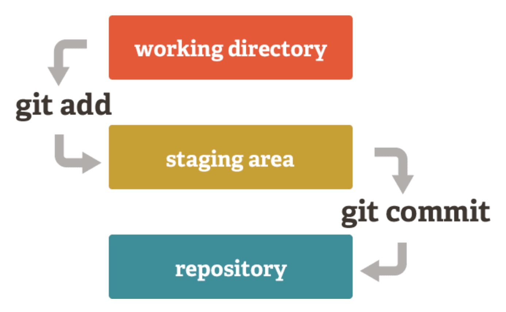

## Creepy Sausage Society 👻


# Why version Control?


## Why?
- Easy way to fix mistakes
- Protection from human error
- Tracking of every individual change and prevent work from conflicting


# Git vs Github


## Git: What is it?
- The most widely used version control system
- Git takes snapshots
    - Taking a picture of what your files look like at that given time


## Git: What makes it unique?



## Git: What makes it unique?
- Branching!
- Allows multiple people to work without effecting each other


## Git: Branches
- Diverge from main line (master)
- Quick to create
- Quick to swap between
- Have as many as you want!


## Github
- Hosting of Git repositories
- Web based interface
- Forking - copying a repository to your account
- Pull request - Offer to share changes you made 
- Merge - Merge the changes found in your repository with the original


# Git Config


## Git config
- You need to set your name and email as Git puts this in every commit
- ```git config --global user.name "Lottie Bryant"```
<!-- .element: class="fragment" -->
- Creating a label for your tins of beans
<!-- .element: class="fragment" -->
- ```git config --global user.email "computerscience@lincolnsu.com"```
<!-- .element: class="fragment" -->
- Adds your email to the label so someone can contact you
<!-- .element: class="fragment" -->
- or yell at you
<!-- .element: class="fragment" -->


# Git Init


## Git Init
- ```git init [repository name]```
- This creates a new repository on your local machine
- What is a repository?


## Repository
- The ```.git/``` folder inside a project
- Tracks all the files
- A sealed tin of beans
<!-- .element: class="fragment" -->


# Git Clone


## Git Clone
- ```git clone [url]```
- Retrieve an existing repository from an existing url
- Having someone else's tin sent to you
<!-- .element: class="fragment" -->


# Git Diff


## Git Diff
- ```git diff```
- Shows differences in files that are not staged
- Comparing your beans in the pan to the old ones in the tin
<!-- .element: class="fragment" -->


# Git Add


## Git Add
- ```git add [file]```&nbsp;&nbsp;&nbsp;&nbsp;&nbsp;&nbsp;&nbsp;<- for a single file
- ```git add .```     &nbsp;&nbsp;&nbsp;&nbsp;&nbsp;&nbsp;&nbsp;&nbsp;&nbsp;&nbsp;&nbsp;&nbsp;&nbsp;&nbsp;&nbsp;&nbsp;&nbsp;&nbsp;&nbsp;&nbsp;&nbsp;<- for all files
- Adds file(s) to the staging area
- Put your beans in any tin
<!-- .element: class="fragment" -->


# Git Commit


## Git Commit
- ```git commit -m "[your commit message]```
- Moves your change from the staging area to the repository
- If the -m is not there it will open in a default editor (most likely vim 😍)
- Seal the tin, label it then put it with your other labelled beans
<!-- .element: class="fragment" -->


# Git Status


## Git Status
- ```git status```
- Lists all the files you want to commit
- Look around and see beans in your pan, in the tin or both
<!-- .element: class="fragment" -->


# Git Checkout


## Git Checkout
- ```git checkout -b <branch name>```
- Create a new branch called `<branch name>`
- ```git checkout <branch name>```
- Changes to the existing branch called `<branc name>`
- Swap to a different tin of beans


# Git Push


## Git push
- ```git push```
- Sends all commits and new branches that aren't currently on the remote to the remote
- Ship your tin of beans to a warehouse
<!-- .element: class="fragment" -->


# Git Stash


## Git stash
- ```git stash```
- Saves your unfinshed work on a stack for you to pick up later
- Pick up your tin of beans and put them on a shelf
<!-- .element: class="fragment" -->


## Git stash pop
- ```git stash pop```
- Reapplies the unfinished changes to your project so you can continue working
- Take the first tin of beans off the shelf and empty the contents
<!-- .element: class="fragment" -->
- Pray to the git gods you won't have conflicts
<!-- .element: class="fragment" -->


# Git reset


## Git reset
- ```git reset HEAD <file>```
- Un-stage one file
- Take one(1) bean out of the tin
<!-- .element: class="fragment" -->


## Git reset
- ```git reset HEAD <directory>```
- Un-stage a whole directory
- Remove several grouped beans from the can
<!-- .element: class="fragment" -->


## Git reset HARD
- ```git reset --hard HEAD```
- Un-stage everything
- Throw the tin of beans into lava. Its gone forever.
<!-- .element: class="fragment" -->


# Git revert


## Git revert
- ```git revert <commit>```
- Creates a new commit that changes files back into their state at specified commit
- Throw your current beans out the window and scoop your old ones out the bin
<!-- .element: class="fragment" -->


# GitHub Desktop


## Git UI
- E.g. Github Desktop, Git kraken
- These are things
- Simplifies using git by hiding what commands are performed
- Maybe a good way to learn


# And now...
# Stuff!
<!-- .element: class="fragment" -->


# Other resources


## Other resources
- https://www.keycdn.com/blog/git-cheat-sheet
- https://duct.me/clgit
- https://ohshitgit.com/
- https://hellowebbooks.com/learn-git/ <- (You have to sign up but get a nice little book)


##### kthxbye
